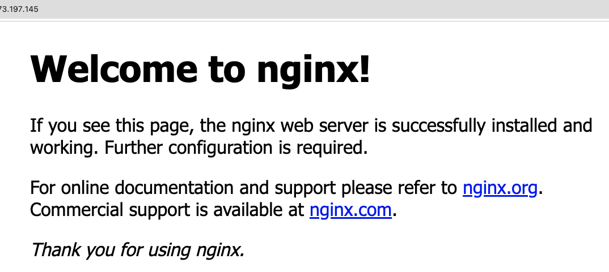

# Terraformのサンプル

※ Infrastructure as Code はその名前の通り、「インフラのコード化」のためのアプローチです。

構成を 宣言的 に記述することによって コードベースでインフラの管理 を行うことができ、属人化を防ぐことができます。

Hashicorp社（VagrantやVaultなどが代表的。）が開発したOSSのInfrastructure as Codeツールです。RubyライクなHCLというDSLでコードを記述します。
また、TerraformはAWS専用のツールではありません。

AWS以外のクラウドであるGoogle CloudやAzureでも使用でき、他にもDatadogやHerokuなどの管理を行うことが可能です。

MacOSにおけるTerraformのインストール
AWS CLIにてアクセスキーとシークレットアクセスキーを連携させる。
```
brew install terraform
```
### バージョン 確認
```
terraform version
```

###  terraform init
設定ファイルを記述したら```terraform init``` コマンドを実行。

```Terraform has been successfully initialized!```と表示されれば問題なし。

###  terraform plan
ソースコードを実行すると実行計画について表示される。
エラーが出るとどの行にミスがあるか表示される。

### terraform apply
ソースコードを実行するとAWSの場合、AWSのリソースが作成される。最後に、
```Do you want to perform these actions?```と入力を求められるので、```yes```と入力する。

実行されていい部分があるとエラー表示される。

## インフラ構成

VPC-EC2

Welcome to nginx!? 表示



# 参考URL

Terraform(AWS)ドキュメント
https://registry.terraform.io/providers/hashicorp/aws/latest/docs
